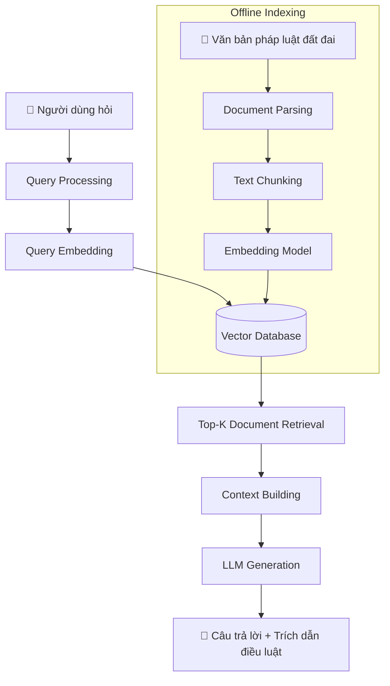
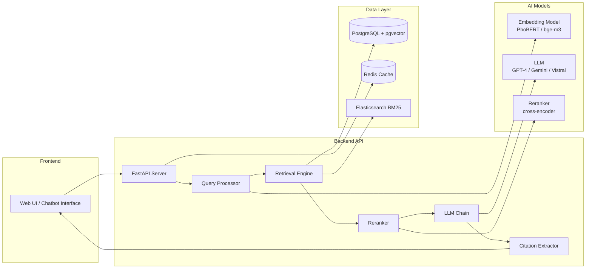

# 🏛️ Hệ Thống Hỏi Đáp Đất Đai — RAG Architecture
## Toàn Bộ Kiến Thức, Quy Trình & Công Nghệ

---

## 1. Tổng Quan Kiến Trúc RAG

**RAG (Retrieval-Augmented Generation)** = Truy xuất tài liệu liên quan + Sinh câu trả lời bằng LLM.



---

## 2. Kiến Thức Nền Tảng Cần Nắm

### 2.1 Kiến Thức Về Domain Đất Đai

| Loại tài liệu | Ví dụ cụ thể |
|---|---|
| Luật | Luật Đất đai 2024 (số 31/2024/QH15) |
| Nghị định | NĐ 101/2024/NĐ-CP, NĐ 102/2024/NĐ-CP |
| Thông tư | TT 08/2024/TT-BTNMT |
| Quy trình hành chính | Thủ tục chuyển nhượng, tặng cho, thừa kế |
| Phí & lệ phí | Biểu phí công chứng, lệ phí trước bạ |

> [!IMPORTANT]
> Luật Đất đai 2024 có hiệu lực từ 01/08/2024, thay thế Luật 2013. Mọi tài liệu training phải được cập nhật theo văn bản mới nhất.

### 2.2 Kiến Thức AI/ML Cần Có

```
NLP (Natural Language Processing)
├── Tokenization (tiếng Việt: underthesea, pyvi)
├── Named Entity Recognition (NER) — nhận dạng điều luật, số hiệu
├── Text Embeddings — biến văn bản → vector
└── Semantic Search — tìm kiếm theo nghĩa

LLM (Large Language Models)
├── Prompt Engineering
├── In-context Learning
├── Hallucination Mitigation
└── Fine-tuning (optional)

Information Retrieval
├── TF-IDF (BM25) — sparse retrieval
├── Dense Retrieval — vector similarity
├── Hybrid Search — kết hợp cả hai
└── Reranking — sắp xếp lại kết quả
```

### 2.3 Kiến Thức Kỹ Thuật Cần Có

- **Python** (cơ bản đến nâng cao)
- **REST API** (FastAPI / Flask)
- **Database**: PostgreSQL + pgvector hoặc Qdrant/Weaviate
- **Docker & Docker Compose**
- **Git & CI/CD cơ bản**

---

## 3. Kiến Trúc Hệ Thống Chi Tiết



---

## 4. Quy Trình Thực Hiện Từng Bước

### Phase 1: Thu Thập & Chuẩn Bị Dữ Liệu (2-3 tuần)

```
BƯỚC 1: Thu thập văn bản pháp luật
├── Tải từ cổng thông tin: thuvienphapluat.vn, vbpl.vn
├── Định dạng: PDF, DOC, HTML
└── Số lượng mục tiêu: 500-1000 văn bản cốt lõi

BƯỚC 2: Làm sạch & chuẩn hóa
├── PDF parsing: pdfplumber, PyMuPDF
├── Loại bỏ header/footer, số trang
├── Chuẩn hóa encoding UTF-8
└── Xử lý bảng biểu đặc biệt

BƯỚC 3: Metadata extraction
├── Số hiệu văn bản (VD: 31/2024/QH15)
├── Ngày ban hành, hiệu lực
├── Điều, khoản, điểm cụ thể
└── Cơ quan ban hành
```

### Phase 2: Xây Dựng Pipeline Indexing (2-3 tuần)

```python
# Ví dụ cấu trúc chunking cho văn bản pháp luật
class LegalDocumentChunker:
    """
    Chiến lược chunking thông minh cho văn bản pháp luật:
    - Chunk theo Điều (Article-level chunking)
    - Overlap để không mất context
    - Giữ nguyên metadata: số điều, khoản, điểm
    """
    def chunk_by_article(self, text: str) -> List[Chunk]:
        # Tách theo pattern: "Điều X." hoặc "Article X."
        # Mỗi chunk = 1 điều luật + context xung quanh
        pass
    
    def chunk_with_overlap(self, text: str, 
                            chunk_size: int = 512,
                            overlap: int = 128) -> List[Chunk]:
        pass
```

**Chiến lược chunking cho văn bản pháp luật:**

| Chiến lược | Khi dùng | Chunk size |
|---|---|---|
| Article-level | Luật, Nghị định có cấu trúc rõ | Cả điều luật |
| Fixed-size with overlap | Văn bản hành chính dài | 512-1024 tokens |
| Semantic chunking | Văn bản giải thích, hướng dẫn | Theo đoạn văn |
| Hierarchical | Luật lớn có chương/mục | Multi-level |

### Phase 3: Embedding & Vector Store (1-2 tuần)

```python
# Lựa chọn Embedding Model cho tiếng Việt
EMBEDDING_OPTIONS = {
    "bge-m3": {
        "provider": "BAAI",
        "dims": 1024,
        "pros": "Đa ngôn ngữ, hiệu suất cao",
        "cons": "Cần GPU",
        "recommended": True  # ⭐ Khuyến nghị
    },
    "PhoBERT": {
        "provider": "VinAI",
        "dims": 768,
        "pros": "Được train trên tiếng Việt",
        "cons": "Không multilingual"
    },
    "text-embedding-3-small": {
        "provider": "OpenAI",
        "dims": 1536,
        "pros": "Dễ dùng, API",
        "cons": "Tốn phí, phụ thuộc internet"
    }
}
```

### Phase 4: Retrieval Engine (2-3 tuần)

```
HYBRID SEARCH PIPELINE:
                    Query
                      │
            ┌─────────┴─────────┐
            ▼                   ▼
     Dense Retrieval      Sparse Retrieval
     (Vector Search)      (BM25/Keyword)
     pgvector/Qdrant      Elasticsearch
            │                   │
            └─────────┬─────────┘
                      ▼
              Score Fusion (RRF)
              Reciprocal Rank Fusion
                      │
                      ▼
                 Reranker
             (Cross-Encoder)
                      │
                      ▼
              Top-K Documents
```

### Phase 5: LLM Integration & Prompt Engineering (2-3 tuần)

```python
# System Prompt mẫu cho hệ thống đất đai
SYSTEM_PROMPT = """Bạn là chuyên gia tư vấn pháp luật đất đai Việt Nam.
Nhiệm vụ: Trả lời câu hỏi dựa HOÀN TOÀN vào các điều luật được cung cấp.

QUY TẮC:
1. Chỉ trả lời dựa trên context được cung cấp
2. Luôn trích dẫn nguồn: số Điều, Khoản, văn bản pháp luật
3. Nếu không có đủ thông tin → thừa nhận giới hạn
4. Không suy diễn ngoài văn bản pháp luật
5. Lưu ý hiệu lực pháp lý của từng văn bản

CONTEXT:
{retrieved_documents}

CÂU HỎI: {user_question}

TRẢ LỜI (kèm trích dẫn):"""
```

### Phase 6: Đánh Giá & Tối Ưu (2-3 tuần)

```
RAGAS Evaluation Framework:
├── Faithfulness: Câu trả lời có trung thực với context?
├── Answer Relevancy: Có trả lời đúng câu hỏi không?
├── Context Precision: Context retrieved có chính xác không?
├── Context Recall: Có lấy đủ context cần thiết không?
└── Answer Correctness: So sánh với ground truth
```

---

## 5. Stack Công Nghệ Chi Tiết

### 5.1 Data Processing
```
pdfplumber / PyMuPDF     → Đọc PDF
python-docx              → Đọc Word
BeautifulSoup            → Crawl HTML
underthesea / pyvi       → NLP tiếng Việt
langchain                → Orchestration pipeline
```

### 5.2 Embedding & Vector Store
```
BAAI/bge-m3              → Embedding model (⭐ khuyến nghị)
sentence-transformers    → Load embedding models
Qdrant                   → Vector database (production)
pgvector                 → PostgreSQL extension (đơn giản hơn)
FAISS                    → Local/dev vector store
```

### 5.3 Retrieval & Search
```
Elasticsearch            → BM25 full-text search
LangChain Retrievers     → Abstraction layer
rank_bm25                → Lightweight BM25
FlashRank                → Cross-encoder reranker
```

### 5.4 LLM Options
```
GPT-4o / GPT-4o-mini     → OpenAI (chất lượng cao, có phí)
Gemini 1.5 Pro           → Google (free tier tốt)
Vistral-7B               → Tiếng Việt, chạy local (⭐)
Llama-3.1-8B             → Open source, fine-tune được
Claude 3.5 Sonnet        → Anthropic (xuất sắc về reasoning)
```

### 5.5 Orchestration Framework
```
LangChain                → RAG pipeline cổ điển
LlamaIndex               → Tốt cho document Q&A (⭐ khuyến nghị)
Haystack                 → Enterprise-ready
Dspy                     → Programmatic LM
```

### 5.6 Backend & Deployment
```
FastAPI                  → REST API
PostgreSQL               → Metadata storage
Redis                    → Session cache
Docker Compose           → Container orchestration
Nginx                    → Reverse proxy
```

### 5.7 Frontend
```
Streamlit                → Prototype nhanh
React + Ant Design       → Production UI
Chainlit                 → Chat UI chuyên biệt (⭐)
```

### 5.8 Monitoring & Observability
```
LangFuse / LangSmith     → LLM tracing
Prometheus + Grafana     → Metrics
Arize / Evidently        → Model monitoring
```

---

## 6. Cấu Trúc Dự Án

```
terra-legal-ai/
├── 📁 data/
│   ├── raw/                    # Văn bản gốc (PDF, DOCX)
│   ├── processed/              # Văn bản đã làm sạch
│   ├── chunks/                 # Dữ liệu đã chunk
│   └── evaluation/             # Bộ test Q&A pairs
│
├── 📁 ingestion/               # Pipeline xử lý dữ liệu
│   ├── parsers/
│   │   ├── pdf_parser.py
│   │   ├── docx_parser.py
│   │   └── html_parser.py
│   ├── chunkers/
│   │   ├── legal_chunker.py    # Chunk theo điều luật
│   │   └── semantic_chunker.py
│   ├── embedders/
│   │   └── embedding_service.py
│   └── indexers/
│       └── vector_indexer.py
│
├── 📁 retrieval/               # Search engine
│   ├── dense_retriever.py      # Vector search
│   ├── sparse_retriever.py     # BM25
│   ├── hybrid_retriever.py     # Kết hợp
│   └── reranker.py
│
├── 📁 generation/              # LLM integration
│   ├── llm_client.py
│   ├── prompt_templates.py
│   └── answer_generator.py
│
├── 📁 api/                     # FastAPI backend
│   ├── main.py
│   ├── routers/
│   │   ├── chat.py
│   │   └── feedback.py
│   └── schemas/
│
├── 📁 evaluation/              # Đánh giá hệ thống
│   ├── ragas_eval.py
│   ├── test_dataset.json
│   └── metrics.py
│
├── 📁 frontend/                # Giao diện người dùng
│   └── (Streamlit / React)
│
├── 📁 infrastructure/          # DevOps
│   ├── docker-compose.yml
│   ├── nginx.conf
│   └── Dockerfile
│
├── 📁 notebooks/               # Thí nghiệm, EDA
│   ├── 01_data_exploration.ipynb
│   ├── 02_chunking_experiments.ipynb
│   └── 03_retrieval_evaluation.ipynb
│
└── 📁 tests/
```

---

## 7. Thách Thức Đặc Thù & Giải Pháp

### 7.1 Thách Thức Tiếng Việt

| Thách thức | Vấn đề | Giải pháp |
|---|---|---|
| Từ ghép | "đất đai" vs "đất" + "đai" | Dùng underthesea word segmentation |
| Dấu thanh | Mã hóa sai UTF-8 | Normalize Unicode NFC |
| Từ viết tắt | "GCNQSDĐ", "UBND" | Xây dựng từ điển đặc ngành |
| Tên riêng | Địa danh, tên người | NER model cho tiếng Việt |

### 7.2 Thách Thức Văn Bản Pháp Luật

| Thách thức | Giải pháp |
|---|---|
| Văn bản viện dẫn chéo | Xây dựng graph tham chiếu giữa các điều luật |
| Hiệu lực pháp lý thay đổi | Tag metadata ngày hiệu lực, tự động loại bỏ văn bản hết hiệu lực |
| Ngôn ngữ pháp lý khó hiểu | Thêm tầng "simplification" trong prompt |
| Câu hỏi mơ hồ | Query expansion + clarification prompting |

### 7.3 Tránh Hallucination

```python
# Anti-hallucination strategies
strategies = [
    "1. Chỉ dùng thông tin từ retrieved context",
    "2. Yêu cầu LLM trích dẫn số điều khoản cụ thể",
    "3. Faithfulness scoring với RAGAS",
    "4. Self-consistency checking",
    "5. Human-in-the-loop cho câu hỏi phức tạp",
    "6. Confidence scoring + disclaimer khi không chắc"
]
```

---

## 8. Lộ Trình Thực Hiện (Timeline)

```
THÁNG 1: Foundation
├── Tuần 1-2: Thu thập & làm sạch 200+ văn bản pháp luật cốt lõi
├── Tuần 2-3: Xây dựng chunking pipeline
└── Tuần 3-4: Setup vector DB, indexing

THÁNG 2: Core RAG
├── Tuần 1-2: Dense retrieval (vector search)
├── Tuần 2-3: Sparse retrieval (BM25) + Hybrid fusion
└── Tuần 3-4: LLM integration + basic prompting

THÁNG 3: Enhancement
├── Tuần 1-2: Reranker integration
├── Tuần 2-3: Evaluation framework (RAGAS)
└── Tuần 3-4: Prompt optimization + anti-hallucination

THÁNG 4: Production
├── Tuần 1-2: FastAPI backend + frontend
├── Tuần 2-3: Docker deployment
└── Tuần 3-4: Monitoring, logging, feedback loop
```

---

## 9. Bộ Dữ Liệu Đánh Giá (Ground Truth)

```python
# Ví dụ format bộ test
evaluation_dataset = [
    {
        "question": "Thời hạn sử dụng đất ở tại đô thị là bao nhiêu năm?",
        "ground_truth": "Theo Điều 171 Luật Đất đai 2024, đất ở tại đô thị được sử dụng ổn định lâu dài.",
        "reference_law": "Điều 171, Luật Đất đai 2024",
        "category": "thoi_han_su_dung"
    },
    {
        "question": "Thủ tục chuyển nhượng quyền sử dụng đất gồm những bước nào?",
        "ground_truth": "...",
        "reference_law": "Điều 216-218, Luật Đất đai 2024",
        "category": "thu_tuc_hanh_chinh"
    }
]
```

**Mục tiêu metrics:**

| Metric | Mục tiêu |
|---|---|
| Faithfulness | > 0.85 |
| Answer Relevancy | > 0.80 |
| Context Precision | > 0.75 |
| Context Recall | > 0.80 |
| Answer Correctness | > 0.75 |

---

## 10. Nâng Cao (Advanced Features)

### 10.1 Agentic RAG
```
User Query
    │
    ▼
Query Classifier
├── Câu hỏi đơn giản → Basic RAG
├── Câu hỏi phức tạp → Multi-step Reasoning
└── Câu hỏi so sánh → Multi-document Retrieval

Multi-step Agent:
Step 1: Tìm văn bản liên quan
Step 2: Kiểm tra hiệu lực pháp lý
Step 3: Tìm văn bản hướng dẫn thi hành
Step 4: Tổng hợp câu trả lời
```

### 10.2 Knowledge Graph Integration
```
Điều 171 (Luật 2024)
    ├── viện dẫn → Điều 2 (định nghĩa)
    ├── hướng dẫn bởi → NĐ 101/2024
    └── thay thế → Điều 125 (Luật 2013)
```

### 10.3 Multimodal (Bản đồ địa chính)
```
Xử lý ảnh bản đồ địa chính
→ OCR thông tin thửa đất
→ Kết hợp với RAG text
```

---

## 11. Nguồn Tài Nguyên Học Tập

### Papers quan trọng
- "Retrieval-Augmented Generation for Knowledge-Intensive NLP Tasks" (Lewis et al., 2020)
- "RAGAS: Automated Evaluation of Retrieval Augmented Generation" (Es et al., 2023)
- "Hybrid Search with BM25 and Dense Retrieval" 

### Tools & Libraries
- **LlamaIndex Docs**: https://docs.llamaindex.ai
- **LangChain RAG**: https://python.langchain.com/docs/tutorials/rag/
- **RAGAS**: https://docs.ragas.io
- **Qdrant**: https://qdrant.tech/documentation/

### Datasets tiếng Việt
- **UIT-ViQuAD**: Bộ Q&A tiếng Việt
- **ViLegal**: Văn bản pháp luật Việt Nam (nếu có)
- **Thư viện pháp luật**: https://thuvienphapluat.vn

---

## 12. Checklist Hoàn Thiện Dự Án

- [ ] **Data**: Thu thập đủ 500+ văn bản pháp luật đất đai
- [ ] **Parsing**: Pipeline đọc PDF/DOCX hoạt động ổn định
- [ ] **Chunking**: Chiến lược chunk phù hợp với văn bản pháp luật
- [ ] **Embedding**: Model embedding tiếng Việt được cài đặt và test
- [ ] **Vector DB**: Qdrant/pgvector hoạt động, index đầy đủ
- [ ] **BM25**: Elasticsearch chạy song song
- [ ] **Hybrid Search**: Fusion BM25 + Vector hoạt động
- [ ] **Reranker**: Cross-encoder cải thiện accuracy
- [ ] **LLM**: Kết nối LLM, prompt chống hallucination
- [ ] **API**: FastAPI với /chat, /feedback endpoints
- [ ] **UI**: Giao diện chatbot thân thiện
- [ ] **Evaluation**: RAGAS metrics đạt mục tiêu
- [ ] **Monitoring**: Logging mọi query và feedback
- [ ] **Deployment**: Docker Compose production-ready
- [ ] **Security**: Auth, rate limiting, input validation
